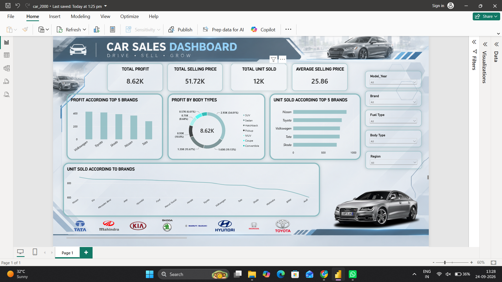

# 🚗 Car Sales Dashboard — 2000

## 📊 Project Overview

This project is an interactive **Power BI Car Sales Dashboard** created to analyze automobile sales performance for the year **2000**. It transforms car sales data into a clean and interactive visual report, making it easier to understand sales volume, profitability, pricing, and brand-wise performance.

The dashboard combines **KPI cards, charts, interactive slicers, and automotive visuals** to provide a simple and engaging way to explore the data.

## 🖥️ Dashboard Preview



## 🎯 Objectives

- Analyze overall car sales performance.
- Compare unit sales across different car brands.
- Analyze profit generated by brands and body types.
- Monitor total and average selling prices.
- Explore sales data using interactive filters.
- Present automobile sales data in an engaging visual format.

## 📌 Dashboard Features

### KPI Cards

The dashboard displays key performance indicators including:

- **Total Profit**
- **Total Selling Price**
- **Total Units Sold**
- **Average Selling Price**

### 📈 Visualizations

The dashboard includes:

- **Profit According to Top 5 Brands**
- **Profit by Body Types**
- **Unit Sold According to Top 5 Brands**
- **Unit Sold According to Brands**
- Interactive automotive imagery and brand visuals

### 🎛️ Interactive Filters

Users can dynamically filter the dashboard using:

- **Model Year**
- **Brand**
- **Fuel Type**
- **Body Type**
- **Region**

The visuals and KPI values update according to the selected filters.

## 💡 Key Analysis

This dashboard can be used to explore:

- Brand-wise sales performance
- Profit contribution by brand
- Profit distribution across body types
- Differences in unit sales between brands
- Selling price performance
- Sales patterns across regions, fuel types, body types, and model years

## 🛠️ Tools & Technologies

- **Microsoft Power BI**
- **Power Query**
- **DAX**
- **Data Visualization**
- **Interactive Slicers**
- **Data Modeling**

## 📁 Project Structure

```text
Car-Sales-Dashboard/
│
├── car_2000.pbix
├── README.md
└── dashboard-screenshot.png
```

## 🚀 How to Use

1. Download or clone this project.
2. Open `car_2000.pbix` using **Microsoft Power BI Desktop**.
3. Use the slicers on the right side of the dashboard.
4. Select different brands, model years, fuel types, body types, or regions.
5. Explore the updated KPIs and visualizations.

## 📌 Project Purpose

This project demonstrates how **Power BI can transform automobile sales data into an interactive business intelligence dashboard**, combining data analysis with an engaging automotive-themed design.

---

### 👨‍💻 Built with Power BI

**Power BI | DAX | Power Query | Data Visualization**
